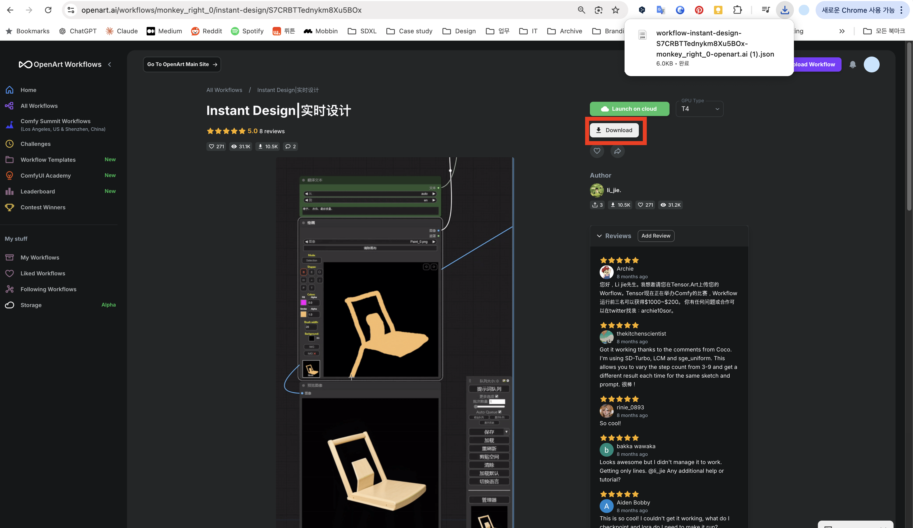
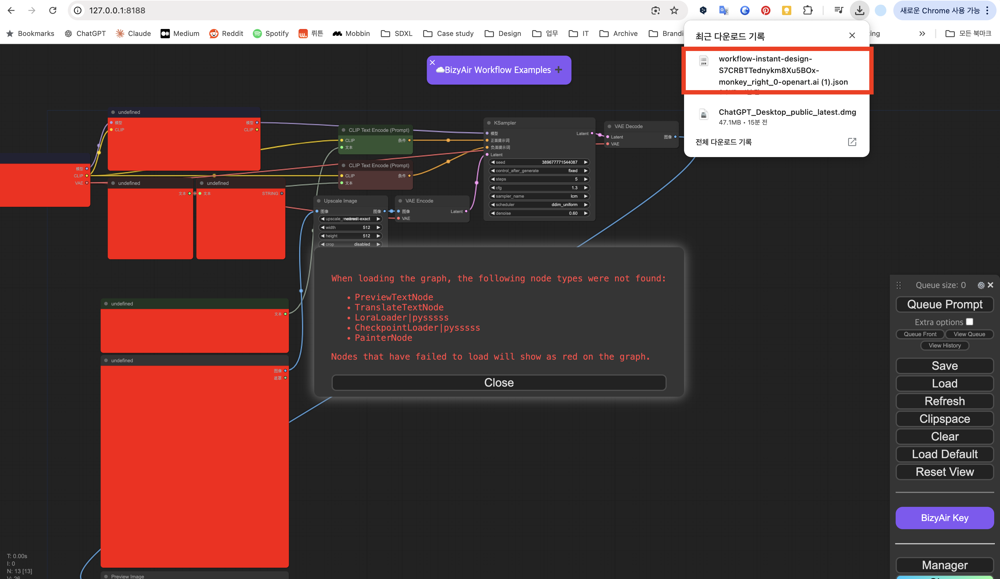
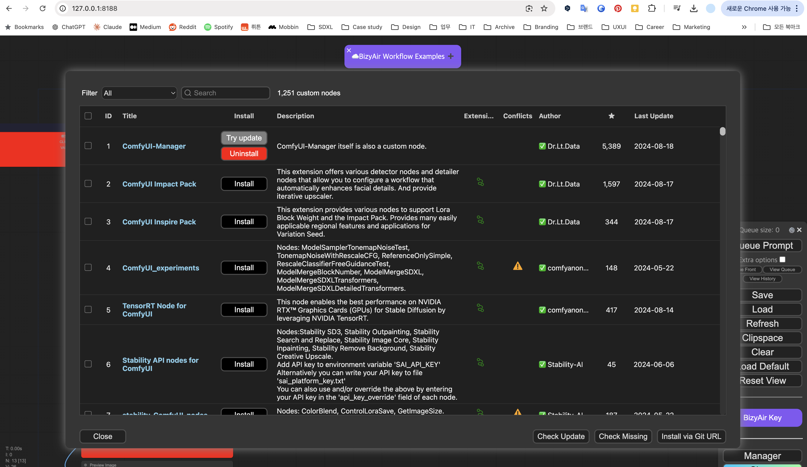
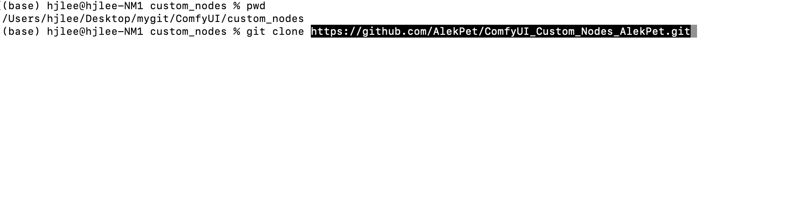

# My-Comfy-UI-Setting

## Overview
- comfyui를 RunPod에서 사용할 수 있도록 합니다.
- (why?) GPU 리소스를 colab보다 자유롭게 사용하기 위함

## Workflow
1. comfyui 실행
```zsh
mygit/ComfyUI % python main.py
# (터미널에 나오는 접속 정보 따라가기, http://127.0.0.1:8188)
```
2. civit-ai / openart에서 원하는 워크플로우 레퍼런스 탐색 후 워크플로우를 comfyui 상에 다운로드 (comfyui에서 import/drag-and-drop)
*OpenArt에서 다운로드*
*다운로드 받은 워크플로우를 drag-and-drop으로 import*
3. 워크플로우에 있는 customnode를 comfyui manager로 다운로드 / 가끔 없는 경우는 직접 github에서 다운로드 후 설치
*Comfyui manager에서 custom node 검색*
*가끔 없는 경우에는 직접 github 검색 후에 다운로드*
4. comfyui에서 워크플로우 실행 (GPU 리소스 사용)
5. (안해봄) 이전에 했던 워크플로우를 불러와서 다시 실행

## Goal : RunPod에서 위 워크플로우대로 작업할 수 있는 환경 만들기
### RunPod에 유지할 파일들
1. comfyui
2. comfyui-manager
3. 워크플로우 수정내역들을 저장하는 공간
4. custom node들 (comfyui 디렉토리 내부에 있음)

### RunPod을 사용하기 위해 필요한 스크립트 (IMPORTANT)
1. Github에서 빠르게 이 레포지토리를 가져오는 스크립트
2. comfyui / comfyui-manager (1+2)를 빠르게 설치하는 스크립트
3. 변경사항들(3+4)을 Github에 빠르게 업로드하는 스크립트

### Consider point
- 작업자는 비전공자, 비개발자. 터미널에 정해진 커맨드만 입력할 수 있는 사람.
- 어디에서나 실행할 수 있는 환경 (python virtualenv / docker environment)
- 빠르게 실행할 수 있는 스크립트 세팅 (Makefile)

## Ver1

### overview
- RunPod의 sd comfyui 환경의 local 셋업 (runpod/stable-diffusion:comfy-ui-5.0.0)
- RunPod에서 외부 git과의 연결 세팅할 수 있는 스크립트

### Quick Start
```bash
git clone https://github.com/uurange/my-comfy-ui-setting.git
cd my-comfy-ui-setting
chmod u+x basic-setup.sh
bash ./basic-setup.sh
make comfy-setup
```

